## 1. System Overview

The AI Meeting Intelligence Platform converts meeting recordings into
searchable knowledge and uses Retrieval-Augmented Generation (RAG) to
answer questions using the meeting's actual content.

```mermaid
flowchart LR
    User[User]

    Video[Meeting Video / Audio]

    Ingestion[Ingestion Pipeline]

    Audio[Audio]
    Transcript[Transcript]
    Chunks[Semantic Chunks]
    Embeddings[Embeddings]
    Qdrant[(Qdrant)]

    Query[User Question]
    Retrieval[Semantic Retrieval]
    Context[Retrieved Context]
    LLM[LLM]
    Response[Grounded Response]

    User --> Video
    Video --> Ingestion

    Ingestion --> Audio
    Audio --> Transcript
    Transcript --> Chunks
    Chunks --> Embeddings
    Embeddings --> Qdrant

    User --> Query
    Query --> Retrieval
    Retrieval --> Qdrant
    Qdrant --> Context
    Context --> LLM
    Query --> LLM
    LLM --> Response
````

The core architecture is:

**Meeting → Knowledge → Vector Search → Retrieval → LLM → Answer**

---

# 2. Architectural Layers

```mermaid
flowchart TB

    Client[Client / User]

    API[API Layer<br/>FastAPI]

    Pipelines[Pipelines<br/>Workflow Orchestration]

    Services[Services<br/>Domain Operations]

    Models[Models<br/>Data Contracts]

    VectorStore[Vector Store<br/>Qdrant]

    Prompts[Prompt System]

    LLM[LLM Runtime<br/>Ollama]

    Storage[Local / Future File Storage]

    Database[PostgreSQL<br/>Future]

    Client --> API
    API --> Pipelines

    Pipelines --> Services
    Pipelines --> Models

    Services --> Models
    Services --> VectorStore
    Services --> Prompts
    Services --> LLM
    Services --> Storage
    Services --> Database
```

### Architectural Rule

```text
Pipeline
    ↓
"What should happen?"

Service
    ↓
"How is the operation performed?"

Model
    ↓
"What data is being passed?"

Vector Store
    ↓
"Where is semantic knowledge stored?"

Prompt System
    ↓
"How should the LLM be instructed?"

LLM
    ↓
"How should the retrieved knowledge be transformed into an answer?"
```

---

# 3. Meeting Ingestion Sequence

The ingestion workflow starts when a meeting recording enters the system.

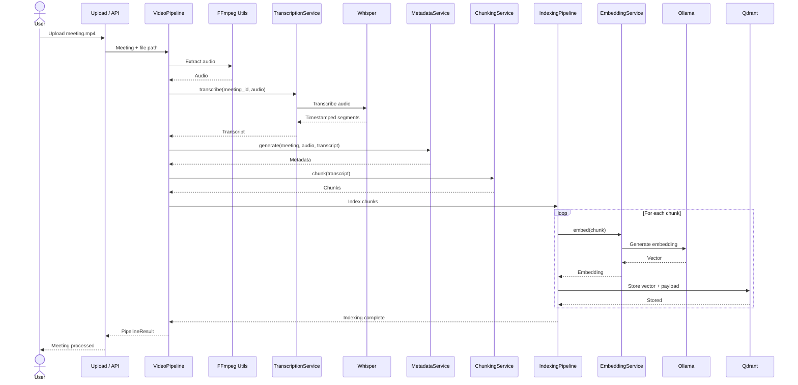

---

# 4. File Lifecycle

The meeting recording moves through several representations.

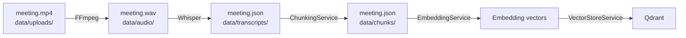

---

# 5. Video Pipeline

### Module

```text
app/pipelines/video_pipeline.py
```

The video pipeline is the main ingestion orchestrator.

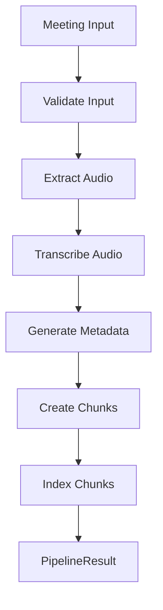

The pipeline coordinates services; it should not duplicate their internal logic.

---

# 6. Audio Extraction

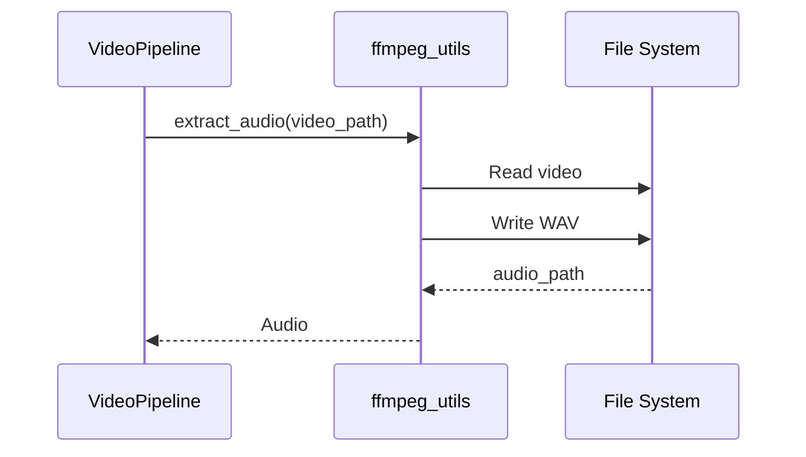

Input:

```text
data/uploads/meeting.mp4
```

Output:

```text
data/audio/meeting.wav
```

---

# 7. Transcription Flow

The transcription service converts audio into the internal `Transcript`
model using Whisper/Faster-Whisper. The service validates the audio,
runs transcription, converts Whisper segments, and returns `Transcript`. 

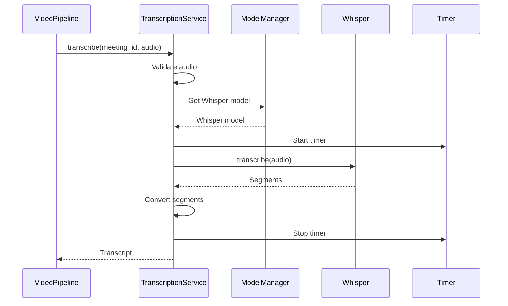

---

# 8. Transcript → Chunk Flow

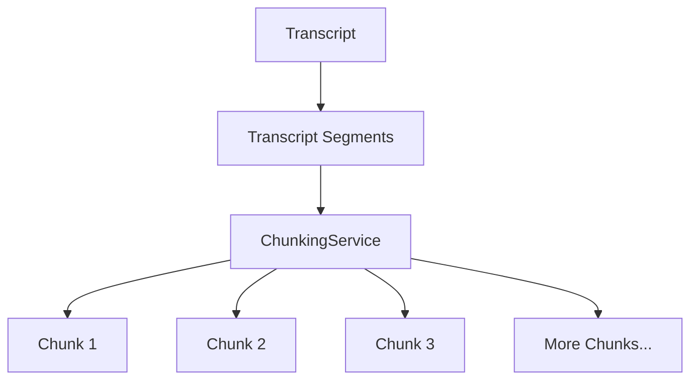

Chunks preserve the information required for retrieval, including
transcript text and timestamp information.

Output:

```text
data/chunks/
```

---

# 9. Chunk → Embedding Flow

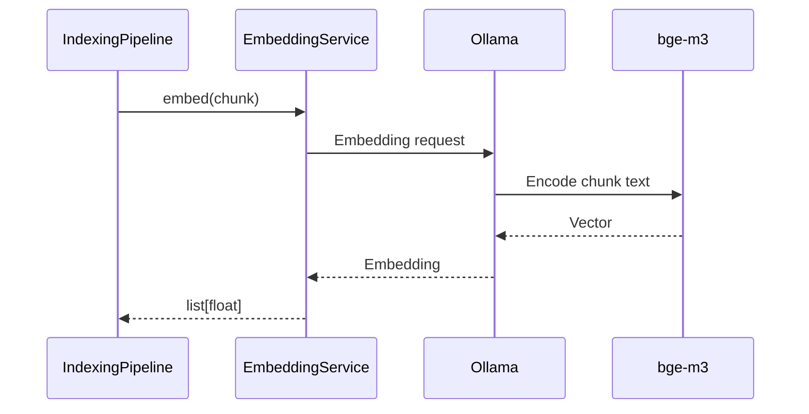

The `EmbeddingService` accepts a `Chunk` and produces an embedding vector. 

---

# 10. Indexing Pipeline

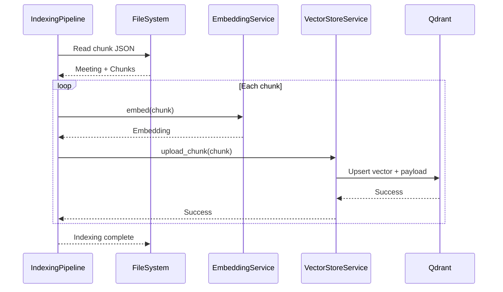

---

# 11. Qdrant Data Model

Each indexed chunk conceptually becomes:

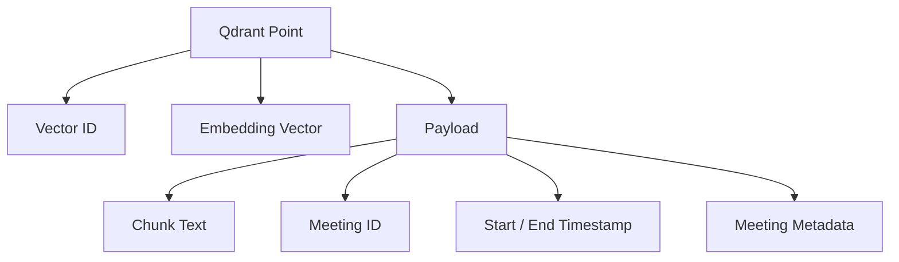

Qdrant is responsible for storing and retrieving vector embeddings and
their associated payloads. 

---

# 12. Query / RAG Sequence

After indexing, the meeting becomes searchable.

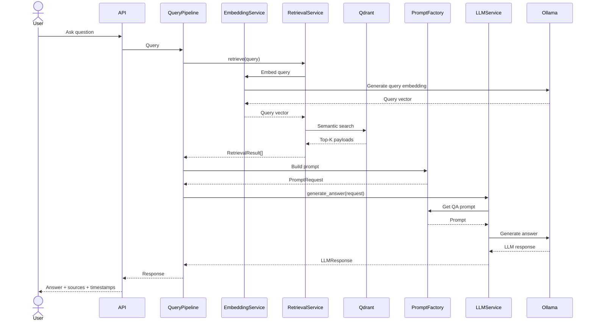

The retrieval service first generates the query embedding, searches
Qdrant, converts returned payloads into `RetrievedChunk` objects, and
returns ranked retrieval results. 

---

# 13. RAG Data Flow

```mermaid
flowchart LR

    Question[User Question]

    Query[Query Model]

    Embedding[Query Embedding]

    Search[Qdrant Semantic Search]

    Retrieved[RetrievedChunk]

    Results[RetrievalResult]

    Prompt[PromptRequest]

    LLMRequest[LLMRequest]

    LLMResponse[LLMResponse]

    Response[Final Response]

    Question --> Query
    Query --> Embedding
    Embedding --> Search
    Search --> Retrieved
    Retrieved --> Results
    Results --> Prompt
    Prompt --> LLMRequest
    LLMRequest --> LLMResponse
    LLMResponse --> Response
```

This directly follows the model contract defined for the project. 

---

# 14. Retrieval Service

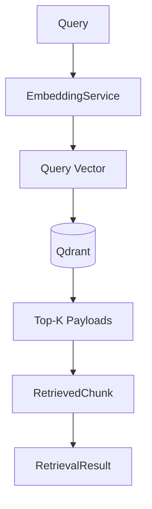

### Responsibility

```text
Query
  ↓
Generate query embedding
  ↓
Search Qdrant
  ↓
Convert payloads
  ↓
Rank results
  ↓
Return RetrievalResult
```

---

# 15. Prompt Construction

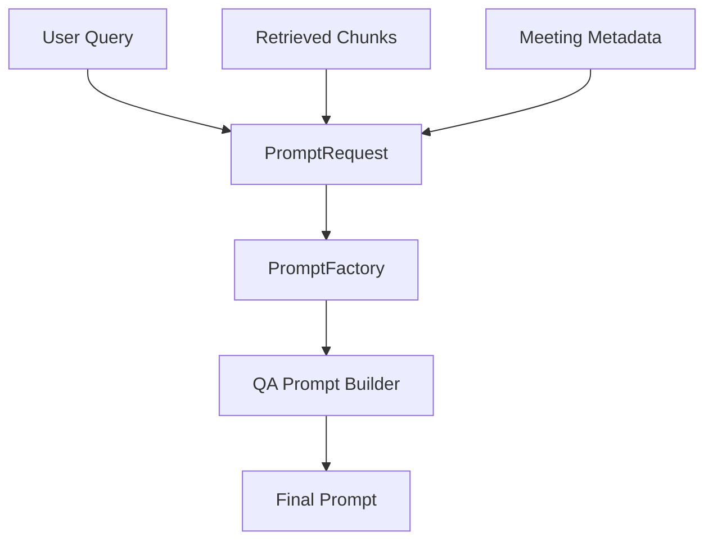

The prompt system separates prompt selection/building from the LLM
service. `LLMService.generate_answer()` obtains the QA prompt builder,
builds the prompt, sends it to Ollama, and returns `LLMResponse`. 

---

# 16. LLM Generation

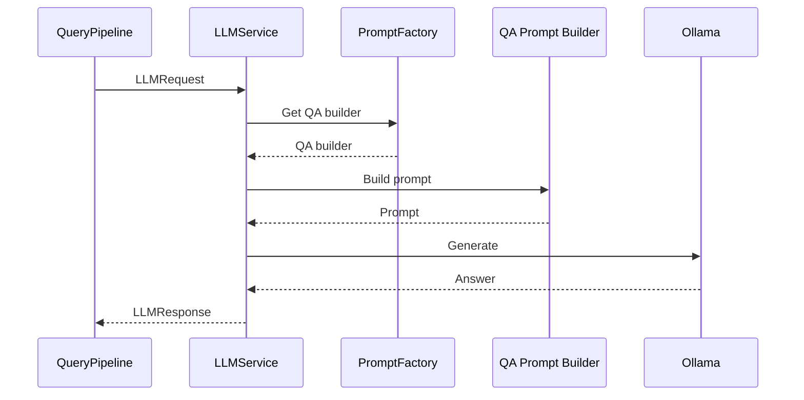

---

# 17. Final Answer Construction

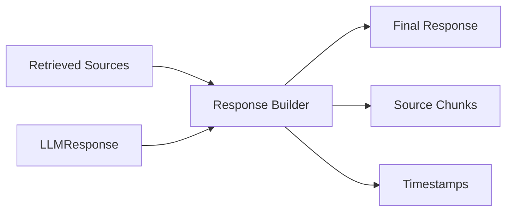

The goal is not simply to return an LLM-generated sentence.

The response should retain the relationship between:

```text
Answer
  ↓
Retrieved evidence
  ↓
Meeting
  ↓
Timestamp
```

---

# 18. Summary Pipeline

The summary pipeline is separate from interactive Q&A.

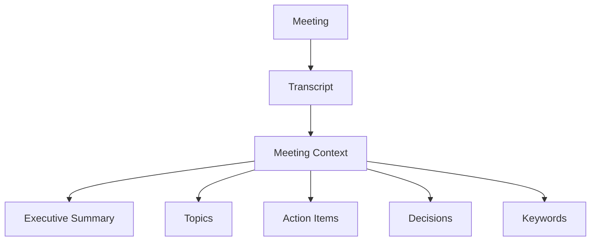

---

# 19. Model Flow

The project's model layer forms the backbone of communication between
components.

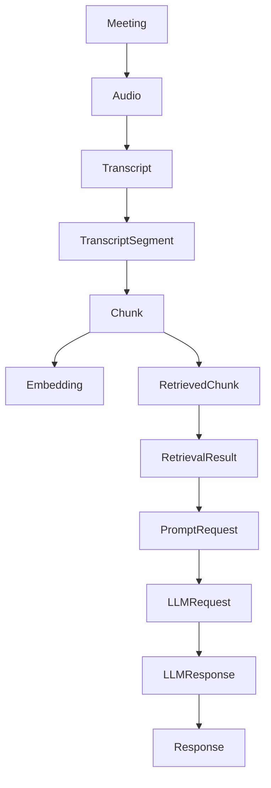

---

# 20. Component Responsibilities

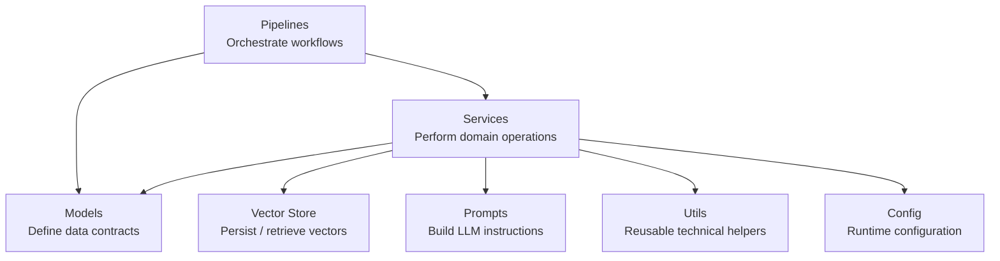

---

# 21. Service Dependency Flow

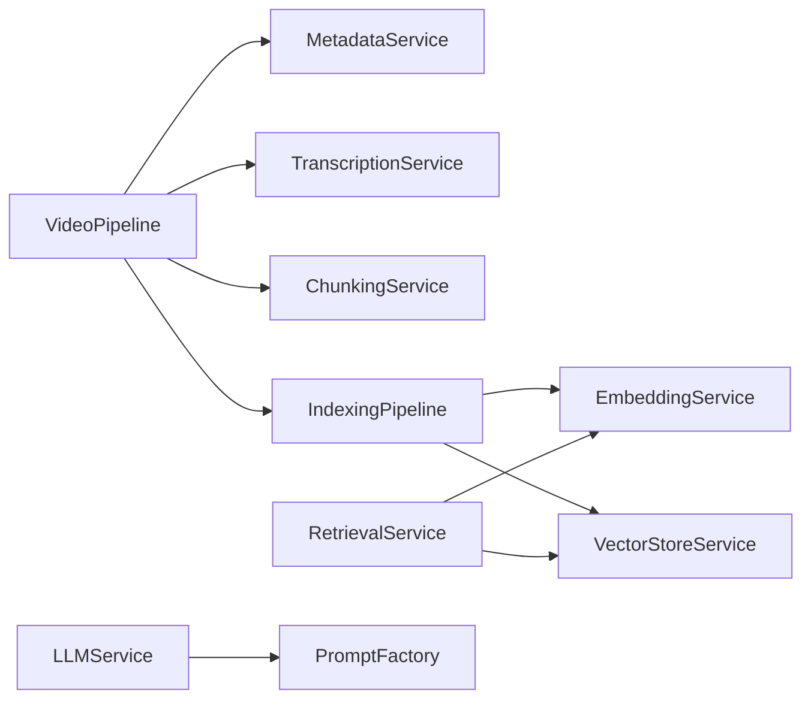

---

# 22. Data Ownership

```mermaid
flowchart TB

    FileSystem["Local File System"]

    FileSystem --> Uploads["data/uploads"]
    FileSystem --> Audio["data/audio"]
    FileSystem --> Transcripts["data/transcripts"]
    FileSystem --> Chunks["data/chunks"]
    FileSystem --> Embeddings["data/embeddings"]
    FileSystem --> Exports["data/exports"]

    Qdrant["Qdrant"]

    Qdrant --> Vectors["Embeddings"]
    Qdrant --> Payload["Chunk Metadata"]
    Qdrant --> Search["Semantic Search"]
```

The current development architecture intentionally keeps the processing
local while the scalable architecture remains future work. 

---

# 23. Testing Architecture

```mermaid
flowchart TD

    Unit[Unit Tests]

    Integration[Integration Tests]

    Pipeline[Pipeline Tests]

    RAG[RAG Tests]

    Unit --> Services
    Integration --> ServiceInteractions
    Pipeline --> EndToEnd
    RAG --> QueryFlow

    Services["Individual Services"]

    ServiceInteractions["Embedding → Qdrant"]

    EndToEnd["Video → Audio → Transcript → Chunks → Embeddings → Qdrant"]

    QueryFlow["Question → Retrieval → Prompt → LLM → Response"]
```

The testing strategy covers unit, integration, pipeline, and RAG-level
testing. 

---

# 24. Current Development State

```mermaid
flowchart LR

    Current["CURRENT"]

    Embedding["EmbeddingService"]
    Qdrant["Qdrant"]
    Indexing["IndexingPipeline"]

    Current --> Embedding
    Current --> Qdrant
    Current --> Indexing
```

Currently implemented core capabilities include:

* Meeting indexing pipeline
* Embedding generation using Ollama / `bge-m3`
* Qdrant vector storage
* Chunk-based semantic indexing

These are the components currently represented as implemented in the
project documentation. 

---

# 25. Target Architecture

```mermaid
flowchart TB

    Frontend["Next.js Frontend"]

    API["FastAPI Backend"]

    Pipelines["AI Processing Pipelines"]

    Whisper["Whisper"]

    Embedding["Embedding Service"]

    Qdrant["Qdrant"]

    PostgreSQL["PostgreSQL"]

    LLM["LLM"]

    Frontend --> API
    API --> Pipelines

    Pipelines --> Whisper
    Pipelines --> Embedding
    Pipelines --> Qdrant
    Pipelines --> LLM

    API --> PostgreSQL
```

Future functionality includes FastAPI, Next.js, authentication,
workspace support, summaries, action-item extraction, decision
extraction, topic detection, sentiment analysis, and export. 

---

# 26. Future Scalable Architecture

```mermaid
flowchart LR

    Upload["Meeting Upload"]

    API["API Gateway"]

    Kafka["Kafka<br/>Event Bus"]

    Transcription["Transcription Worker"]

    Embedding["Embedding Worker"]

    Summary["Summary Worker"]

    Actions["Action Item Worker"]

    Decisions["Decision Worker"]

    Notification["Notification Worker"]

    PostgreSQL[(PostgreSQL)]

    Qdrant[(Qdrant)]

    Storage["File Storage"]

    Redis["Redis"]

    Upload --> API
    API --> Kafka

    Kafka --> Transcription
    Kafka --> Embedding
    Kafka --> Summary
    Kafka --> Actions
    Kafka --> Decisions
    Kafka --> Notification

    Transcription --> PostgreSQL
    Embedding --> Qdrant
    Summary --> PostgreSQL
    Actions --> PostgreSQL
    Decisions --> PostgreSQL
    Notification --> Redis

    Transcription --> Storage
```

This architecture is a future scaling direction rather than the current
local implementation.

---

# 27. Core Architectural Principle

```mermaid
flowchart TD

    Pipeline["Pipeline"]

    Service["Service"]

    Model["Model"]

    Storage["Storage"]

    LLM["LLM"]

    Pipeline -->|"orchestrates"| Service
    Service -->|"uses"| Model
    Service -->|"persists / retrieves"| Storage
    Service -->|"generates intelligence"| LLM
```

Remember:

```text
PIPELINES
Move the workflow.

SERVICES
Perform the operations.

MODELS
Define the data.

VECTOR STORE
Stores and retrieves semantic knowledge.

PROMPTS
Define how the LLM should reason over retrieved context.

LLM
Generates the final intelligence.
```

---

# 28. Complete Platform Flow

```mermaid
flowchart TD

    User["User"]

    Upload["Meeting Upload"]

    VideoPipeline["video_pipeline.py"]

    FFmpeg["FFmpeg"]

    Whisper["Whisper"]

    Transcript["Transcript"]

    Chunking["ChunkingService"]

    Chunks["Chunks"]

    Embedding["EmbeddingService"]

    Vectors["Embeddings"]

    Qdrant[("Qdrant")]

    Question["User Question"]

    Retrieval["RetrievalService"]

    Context["Top-K Retrieved Chunks"]

    Prompt["PromptFactory"]

    LLM["LLMService"]

    Answer["Answer + Sources + Timestamps"]

    User --> Upload
    Upload --> VideoPipeline

    VideoPipeline --> FFmpeg
    FFmpeg --> Whisper
    Whisper --> Transcript
    Transcript --> Chunking
    Chunking --> Chunks
    Chunks --> Embedding
    Embedding --> Vectors
    Vectors --> Qdrant

    User --> Question
    Question --> Retrieval
    Retrieval --> Qdrant
    Qdrant --> Context
    Context --> Prompt
    Question --> Prompt
    Prompt --> LLM
    LLM --> Answer
    Answer --> User
```

---

# 29. One-Line Mental Model

```text
Meeting
  ↓
Audio
  ↓
Transcript
  ↓
Chunks
  ↓
Embeddings
  ↓
Qdrant
  ↓
Retrieve
  ↓
Prompt
  ↓
LLM
  ↓
Grounded Answer
```

The platform therefore turns:

**Meeting Audio → Knowledge → Searchable Memory → Grounded Intelligence**

```
